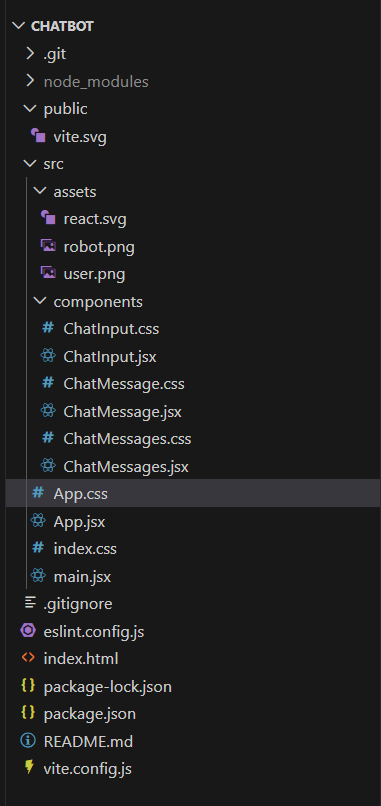
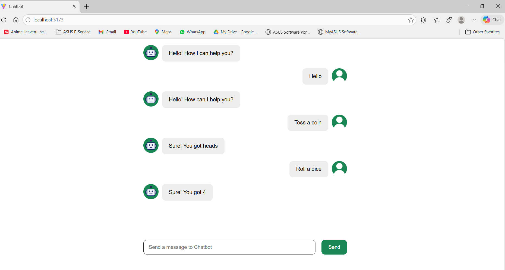

# 🤖 React Chatbot

A simple and interactive **chatbot UI built with React**, demonstrating core React concepts such as **controlled inputs, state management, hooks, component composition, and auto-scrolling chat messages**.

## 🚀 Features

- 💬 Real-time chat interface  
- 🎛️ Controlled input for user messages  
- 🧠 Chatbot responses using `supersimpledev` Chatbot API  
- 🔄 State lifting and unidirectional data flow  
- 📜 Auto-scroll to latest message  
- 👤 User and 🤖 bot avatars  
- 🎨 Clean and responsive chat UI  


## 🛠️ Tech Stack

- **React (Functional Components)**
- **React Hooks** (`useState`, `useEffect`, `useRef`)
- **Vite** (for fast development)
- **CSS** (component-scoped styles)
- **supersimpledev Chatbot API**

## 📂 Project Structure


## 🧠 Key React Concepts Used

- **Controlled Components** – Input value managed by React state  
- **Lifting State Up** – Chat state managed in `App` component  
- **Props** – Data passed cleanly between components  
- **Hooks** –  
  - `useState` for state management  
  - `useEffect` for side effects  
  - `useRef` for auto-scroll behavior  
- **Conditional Rendering** – Different UI for user and bot messages  
- **Immutability** – State updated without mutation  


## ▶️ Getting Started

### Clone the repository
```bash
git clone https://github.com/your-username/react-chatbot.git
cd react-chatbot
```

## Install dependencies
npm install

## Start the development server
npm run dev

## How It Works
1.User types a message in the input field
2.Message is stored in React state
3.Chatbot generates a response
4.Messages are rendered dynamically
5.Chat auto-scrolls to the latest message

## Website


